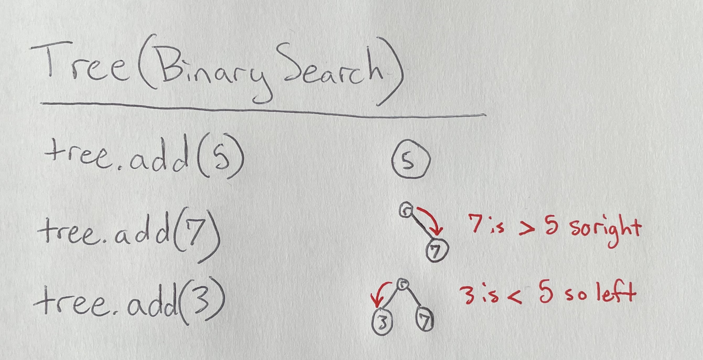

## Trees: Grow()ing The Future

The first data structure we aim to take a look at are Trees.

[Back to Home](0-welcome.md)

<details>
<summary><font size=5><b>What Are They:</b></summary>

<font size=3><b>How Do They Work:</b>

> A Tree is often used for analyzing a collection of data in a type  of order that can show relativity. For example a family tree shows the relation of parent to child. The tree utilizes a range of basic functions that allow for efficiency in application. These functions include a getroot, insert/add, find, delete, and a print.

> One might ask why is their a print function within the tree-based function when one already exists for Python. The answer is, "the same reason the find function is dynamic". When we possess a tree of data their will be a root with it's many existing nodes and leafs that make up the tree. Whenever we want to find something on the tree we need to determine the best type of search in order to more efficiently find the desired node. This could be a depth-first, breadth-first, or a simple traversel of the tree. The differences being do I search through each branch starting left or right side, or do I check each layer before moving to the next.

> The best example of these is relative of an example below mentioning a family tree and a championship bracket. If I follow the champion as my root and want to find the path they took in each match to win the tournament, then I could do a breadth-first as I only need to find which of the two nodes is the champion and then move down that corresponding branch. In a family tree we usually will use a depth-first as we are moving or seeking out the leaf node's lineage through the family tree. There are more options for these searches but these will suffice for now in understanding.

> The print function will follow a similar theme as do I want each branch to print out first, or just go from left-to-right (or vice-versa) printing every node along the way. We need to define or use the defined tree-based print to reference the node data and print off for us in the order we seek to see the data. If I want to print off my branch in geneology going from me to each of my grandparents, then I might need to define a reverse bread-first, or a breadth-last if you will, that would print me, then my mother/father, then my mother's mother/father, and father's mother/father. This can become tedious so often the tree is used in conjunction* with another data structure for storing these values as they are found and then just printing off that structure.

*\* -There is an axample of this beneficial combinations in the conclusion*



<font size=3><b>Why Use Them:</b>

> Before the info dump below the main resaon a Tree is useful is for displaying the parent/child relationship between nodes. This goal is what drive the BIg(O) notation of O(log_2^N) This equation is O() of log base 2 of N. The N being the number of cycles in the function. The search function is shown as this Big(O) notation and is shown in usefulness when a small value such as 1 or 2 is inputed. If only 1 cycle is needed then we are already at the root and that is what is sought. If 2 layers are needed then it will cycle through once from the root. The binary search tree allows for a much easier time of search and insert if the tree is a feasible data structure for the data set. Then the enqueue and dequeue are simply O(1) as it is just the act of placing and removing.

> Now, trees serve as a way of sorting information in order to anlayze factors relating to the data set. A few of these examples include a family tree in geneology or a championship bracket. Though a bracket is an inverted tree it could be analyzed from the winner down until each leaf is found representing every participant within the challenge. The family tree will show relation of node to leaf or parent to child through each generation until the eventual top is reached. This in most belief's goes to Adam and Eve as the first humans. More immediate however parents and grandparents direct lines show one branch of the tree leading to a leaf whether that be you or your posterity so forth.

> Because of this straightforward lineage that occurs in a tree is it much easier to insert and delete from a tree. Though I hope you don't delete someone from your family tree whenever a new child is born they are immediately attached as a leaf to the respective parents node. Similarly, searching is considerably faster as if we want to see who the champion faced in the second or even first match we can simply trace down the branch following the champion until that layer or level in the tree we seek.

> Finding a great-great-great-grandparent can be just as easy and fast, assuming the tree is completed in some of its glory. We start at the leaf/child we want to know the great-great-great-grandparent of and then walk up each edge or link from parents to the parents of the parents and so forth until the desired node is located.


<font size=3><b>Limitations:</b>

> Alright, I admit. A family tree and champion's bracket aren't always considered true trees in the definition of the data structure, they exhibit many of the core qualities and strengths of them. In inverse analization, however, a tree data structure can be limited by computing power or simply the way it is built in the program. Their may only be room for 2 children nodes on each parent node. The tree can be unbalanced if the wrong root is picked and the tree is left unbalanced. This causes extra unnecessary computing power to be consumed. Without babysitting of the tree it can fail just as swiftly as it can assist for good in a program.

> Depending on the versality of the program and what is needed from a data structure it might be more beneficial to pick something like a map, linked list, or dictionary structure. However if the goal is to continue to build layer by layer forever such as the family tree for geneological research it may be more beneficial to use a tree and encorporate the necessary overhead in order to maintain the tree and the various nodes encorporated.
</details>
<br>
</details>

<details>
<summary><font size=5><b>Example Problem:</b></summary>
<font size=3><br>

*\* This function was taken from a previous assignment completed for CSE 212*

> Only breifly hinted at above Trees obviously utilize recursion. It is possible to use the tree without but to save computational power this is the most efficient method. For the Practice Problem we will utilize recursion to solve a search through a BST, or Binary Search Tree. For this problem we will just address basic recursion for implementing the insert function. To begin we have the in initial insert function that is called in the use of the tree which will then reference a recursive _insert() function.

```python
def insert(self, data):
        """
        Insert 'data' into the BST.  If the BST
        is empty, then set the root equal to the new 
        node.  Otherwise, use _insert to recursively
        find the location to insert.
        """
        if self.root is None:
            self.root = BST.Node(data)
        elif data in tree:
          return
        else:
            self._insert(data, self.root)  # Start at the root
```

<details>
<summary><b>Problem:</b></summary>

*\* This function was taken from a previous assignment completed for CSE 212*

> Before we implement a full BST for the tree walk through each comment and try to visualize as we attempt to insert an item into the tree. As mentioned above, for this insert we will analyze a current node and move down the tree checking whether it should be on the left or right of the current node and if there is an empty spot to place the new node.

```python
    def _insert(self, data, node):
        """
        This function will look for a place to insert a node
        with 'data' inside of it.  The current sub-tree is
        represented by 'node'.  This function is intended to be
        called the first time by the insert function.
        """
        # The data belongs on the left side.

        # We found an empty spot

        # Need to keep looking.  Call _insert
        # recursively on the left sub-tree.

        # The data belongs on the right side.

        # We found an empty spot

        # Need to keep looking.  Call _insert
        # recursively on the right sub-tree.

```
</details>

<details>
<summary><font size=3><b>Solution:</b></summary>

*\* This function was taken from a previous assignment completed for CSE 212*

> Now see how the insert will take a data and current node. These values are checked and then we move either left or right down a tree. That place is then checked if it is empty or not. If not then recursion is implemented by calling the _insert(data, current node). This will then repeat the process until an empty spot for the new node is found.

```python
    def _insert(self, data, node):
        """
        This function will look for a place to insert a node
        with 'data' inside of it.  The current sub-tree is
        represented by 'node'.  This function is intended to be
        called the first time by the insert function.
        """
        if data < node.data:
            # The data belongs on the left side.
            if node.left is None:
                # We found an empty spot
                node.left = BST.Node(data)
            else:
                # Need to keep looking.  Call _insert
                # recursively on the left sub-tree.
                self._insert(data, node.left)
        else:
            # The data belongs on the right side.
            if node.right is None:
                # We found an empty spot
                node.right = BST.Node(data)
            else:
                # Need to keep looking.  Call _insert
                # recursively on the right sub-tree.
                self._insert(data, node.right)
```
</details>

</details>
<br>

<details>
<summary><font size=5><b>Practice Problem:</b></summary>
<font size=3><br>

> Below is a practice problem that will ask you to implement a reverse travers through a tree and then print off the tree. When following the instruction visualize how the tree works. If needed comment out some of the inserts and experiement how the tree will organize where they need to be similar to how we discussed a family tree how the child/leaf will simply be attached below their corresponding parent node.
<details>
<summary><b>Problem:</b></summary>
<br>

[Code For Practice Problem](Python%20Files/Trees-Prob.py)

```python
class Tree:
  
  class Node:

    def __init__(self, data, left=None, right=None):
      self.left = left
      self.right = right
      self.data = data
  
  def __init__(self):
    self.root = None
 
  def insert(self, data):
    """
    Insert
    """
    if self.root is None:
        self.root = Tree.Node(data)
    elif data in tree:
      return
    else:
        self._insert(data, self.root)

  def _insert(self, data, node):
    """
    Insert recursion
    """
    if data < node.data:
      if node.left is None:
        node.left = Tree.Node(data)
      else:
        self._insert(data, node.left)
    else:
      if node.right is None:
        node.right = Tree.Node(data)
      else:
        self._insert(data, node.right)
  

  def __iter__(self):
    """
    Perform a forward traversal
    """
    yield from self._traverse_forward(self.root)

  def _traverse_forward(self, node):
    if node is not None:
      yield from self._traverse_forward(node.left)
      yield node.data
      yield from self._traverse_forward(node.right)


  def __reversed__(self):
    """
    Perform a reversed forward traversal (reversed in-order traversal)

    """

  def _traverse_backward(self, node):
    """
    Does a backwards traversal (reverse in-order traversal).  
    """
  

tree = Tree()
tree.insert(5)
tree.insert(3)
tree.insert(7)

print("Forward (Left -> Right)")
for x in tree:
    print(x)

##############################################################################
# Problems To Solve
##############################################################################    

"""
This is the first step in the problem. 
Implement the reverse/traverse-backward functions.
"""
print("Forward (Right -> Left)")
for x in reversed(tree):
    print(x)

"""
After the traverse backward is implemented add this set to the existing tree.
After the values are inserted print the countdown.
"""
nlist = (4, 6, 2, 8, 1, 9)

# Insert the values of the list into the tree

# Print the Countdown
print("\nCountdown to Take-Off")
```

</details>
<details>
<summary><font size=3><b>Solution:</b></summary>
<br>

[Code For Solution](Python%20Files/Trees-Sol.py)

```python
class Tree:
  
  class Node:

    def __init__(self, data, left=None, right=None):
      self.left = left
      self.right = right
      self.data = data
  
  def __init__(self):
    self.root = None
 
  def insert(self, data):
    """
    Insert
    """
    if self.root is None:
        self.root = Tree.Node(data)
    elif data in tree:
      return
    else:
        self._insert(data, self.root)

  def _insert(self, data, node):
    """
    Insert recursion
    """
    if data < node.data:
      if node.left is None:
        node.left = Tree.Node(data)
      else:
        self._insert(data, node.left)
    else:
      if node.right is None:
        node.right = Tree.Node(data)
      else:
        self._insert(data, node.right)
  
  def __iter__(self):
    """
    Perform a forward traversal
    """

    yield from self._traverse_forward(self.root)

  def _traverse_forward(self, node):
    if node is not None:
      yield from self._traverse_forward(node.left)
      yield node.data
      yield from self._traverse_forward(node.right)

  def __reversed__(self):
    """
    Perform a reversed forward traversal (reversed in-order traversal)

    """        
    yield from self._traverse_backward(self.root)

  def _traverse_backward(self, node):
    """
    Does a backwards traversal (reverse in-order traversal).  
    """
    if node is not None:
      yield from self._traverse_backward(node.right)
      yield node.data
      yield from self._traverse_backward(node.left)
  

tree = Tree()
tree.insert(5)
tree.insert(3)
tree.insert(7)

print("Forward (Left -> Right)")
for x in tree:
    print(x)

"""
This is the first step in the problem. 
Implement the reverse/traverse-backward functions.
"""
print("\nForward (Right -> Left)")
for x in reversed(tree):
    print(x)

"""
After the traverse backward is implemented add this set to the existing tree.
Then implement the traverse backward print for it to print 9, 8, 7, 6, 5, 4, 3, 2, 1
"""
nlist = (4, 6, 2, 8, 1, 9)

for i in nlist:
  tree.insert(i)

print("\nCountdown to Take-Off")
for x in reversed(tree):
    print(x)
```

</details>
</details>
</br>

[To Queues ->](2-topic.md)