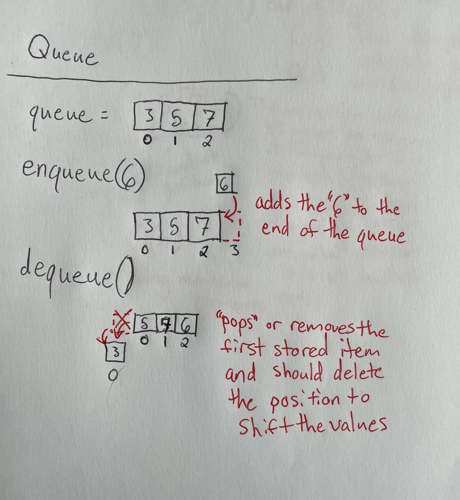

## Queue: The Lineage of Creation()

[Back To Home](0-welcome.md)

### What Are They:

<details>
<summary>How Do They Work:</summary>
<br>

> A queue has been used in general practice for ages. The principle behind it being "First In, First Out". It is the line by which we wait at the movies or at the DMV. All lines are a queue and within programming a queue is not that different. Each data object is placed on the back of the queue which will continue to be pushed on as a line and there will exist a pointer or position contained at the back and front of the Queue. The insert relative to the back position pointer where the object is placed on the back and the delete or peek being relative to the front as we either check the front of the line or use the data object and remove them from the line.


</details>
<br>

<details>
<summary>Why Use Them:</summary>
<br>

> The Queue is a rather simple stack for creating a structure of data that already lines up values in order. The idea of this being that the Big(O) notation of the insertion and deletion being a O(1) which means we already point at the value or position to be deleted or inserted. So when a new value is insterted at the end of the queue, it will be at the back of the line and when we delete or use a value from the queue it will have been from the front.
</details>
<br>


<details>
<summary>Limitations:</summary>
<br>

> As we use a queue we find they really are only designed for the line like use of data. We could begin to use a deque which allows for access to data nodes from the back of the line but if data is going to be needed more often from the back something like a stack might be more beneficial.
</details>
<br>

### Example Problems:

<details>
<summary>Problem:</summary>
<br>

```python
def enqueue(value) {
  # This function will simply add the value to the queue. 
  # Assuming the queue has already been initilized as self.queue = []
  
  # Add your portion to add value to the queue
}

# Then add a portion of code to add a few people to the line: ("Bob", "Han", and "Max")
# You won't need to worry about the print just yet.
```
</details>
<br>


<details>
<summary>Solution For Example:</summary>
<br>

```python
def enqueue(value) {
  # This function will simply add the value to the queue. 
  # Assuming the queue has already been initilized as self.queue = []
  
  self.queue.append(value)
}

# Then add a portion of code to add a few people to the line: ("Bob", "Han", and "Max")
# You won't need to worry about the print just yet.
# Assume a queue has already been made by queue = Queue()

queue.enqueue("Bob")
queue.enqueue("Han")
queue.enqueue("Max")
```
</details>
<br>

### Your Turn To Practice:

<details>
<summary>Problem:</summary>
<br>

[Code For Practice Problem](Python%20Files/Queue-Prob.py)

```python
class Queue:
    """
    Maintain a Queue using a List
    """

    def __init__(self):
        """
        Initialize the empty queue using a Python List.  
        """
        self.queue = []

    def enqueue(self, value):
        """
        Enqueue the value provided into the queue
        """
        # Add necessary code

    def dequeue(self):
        """
        Dequeue the next value and return it
        """
        if len(self.queue) <= 0:
            raise IndexError()
         
        value = self.queue[0] 
        del self.queue[0]
        return value

##################################################################
# Problems to solve
###################################################################
# 1 Initilize a new queue
# 2 Add ("Bob","Han","Max")
#   Hint: This can be used from the example problem
# 3 Serve "Bob" using the dequeue()
# 4 Add ("Joe")
# 5 Print results clearing the queue
#   Hint: This should print Han, Max, Joe and the queue will be empty after
```
</details>
<br>


<details>
<summary>A Possible Solution:</summary>
<br>

[Code For Practice Solution](Python%20Files/Queue-Sol.py)

```python
class Queue:
    """
    Maintain a Queue using a List
    """

    def __init__(self):
        """
        Initialize the empty queue using a Python List.  
        """
        self.queue = []

    def enqueue(self, value):
        """
        Enqueue the value provided into the queue
        """
        # Add necessary code
        self.queue.append(value)

    def dequeue(self):
        """
        Dequeue the next value and return it
        """
        if len(self.queue) <= 0:
            raise IndexError()
         
        value = self.queue[0] 
        del self.queue[0]
        return value

##################################################################
# Problems to solve
###################################################################
# 1 Initilize a new queue
queue = Queue()

# 2 Add ("Bob","Han","Max")
#   Hint: This can be used from the example problem
queue.enqueue("Bob")
queue.enqueue("Han")
queue.enqueue("Max")

# 3 Serve "Bob" using the dequeue()
print(queue.dequeue())

# 4 Add ("Joe")
queue.enqueue("Joe")

# 5 Print results clearing the queue
#   Hint: This should print Han, Max, Joe and the queue will be empty after
print(queue.dequeue())
print(queue.dequeue())
print(queue.dequeue())

# print(queue.dequeue()) # Notice that if we pass the stored values it will print error
# This portion can be written multiple ways to achieve the same results.
```
</details>
<br>


[To Sets ->](3-topic.md)