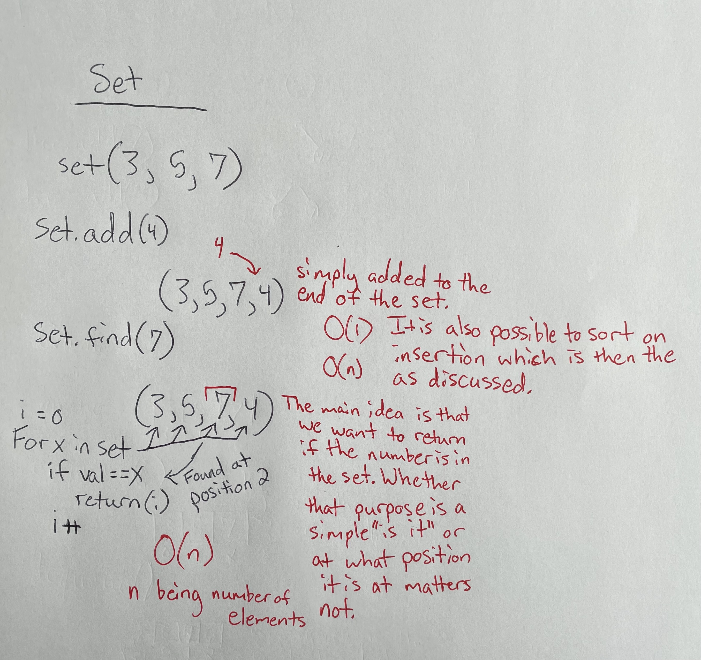

## Sets: A Saga() To Remember

[Back To Home](0-welcome.md)

### What Are They:

How Do They Work:

 
A Set is a simple collection of data objects or nodes. Though referring to them as nodes is less likely as there isn't really a pointer from one node to another like some of the other structures. A set is simply an ordered list of items. So if we store "7" first and then "5" next, the set will be ("7", "5") where 7 is stored at set[0] or position 0 and 5 is at set[1] or position 1 in the set.

This structure was saved for last as it is the most straightforward. The Big(O) notation of the set is the same as the array with a O(n) for the search, insertion, and deletion, and a O(1) for the access as once the position of an element is found it can simply be used.

 

Why Use Them:

 
A set is one of the easiest implementations as the amount of code to get it functioning is rather simple compared to some more robust data structures such as the tree. When a set is implimented it can be used to sort values within the array. The easiest way of show thing being a set of (3, 5, 7) with the add cycling and inserting the value between the 3 and 5. The rest of the add must then shift the values so it will become (3, 4, 5, 7).

This allows us to sort the data in an orderly fashion and then we can also account for number already accounted for within the set. If another 5 is added then we can either add it into the set so it is (3, 4, 5, 5, 7); or we don't want repeated values and leave it at (3, 4, 5, 7).

Sets can be used for sorting, combining two sets of data, or even finding values common to two different data sets. An example of this is to find common movies on multiple "top ten movies" sets; this being a union. The intersection could be used for only returning unique values from both sets, to analyze what movies might be unique and if they are actually good or is it a result of someone's personality.

 

Limitations:

 
The Limitations of a set shine through when we do not necessarily care for sorting, or the the values we seek to add aren't already sorted with a hefty amount of values. This can be seen when we begin with a 5 then 100 then 50 and so forth for every number in between. We will have to continue shifting every value after it is inserted. This process can be cut down but doing a type of insert, delete, and find that takes a halfway point and cycle through up or down similar to the BST from the first data structure.

 

### Example Problems:

Problem:

 

 

Solution For Example:

 

 

### Your Turn To Practice:

Problem:

 

 

A Possible Solution:

 

 

[To Conclusions ->](4-conclusion.md)