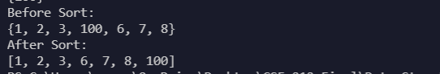

## Sets: A Saga() To Remember

[Back To Home](0-welcome.md)

### What Are They:

<details>
<summary>How Do They Work:</summary>
<br>

> A Set is a simple collection of data objects or nodes. Though referring to them as nodes is less likely as there isn't really a pointer from one node to another like some of the other structures. A set is simply an ordered list of items. So if we store "7" first and then "5" next, the set will be ("7", "5") where 7 is stored at set[0] or position 0 and 5 is at set[1] or position 1 in the set.

> This structure was saved for last as it is the most straightforward. The Big(O) notation of the set is the same as the array with a O(n) for the search, insertion, and deletion, and a O(1) for the access as once the position of an element is found it can simply be used.


</details>
<br>

<details>
<summary>Why Use Them:</summary>
<br>

> A set is one of the easiest implementations as the amount of code to get it functioning is rather simple compared to some more robust data structures such as the tree. When a set is implimented it can be used to sort values within the array. The easiest way of show thing being a set of (3, 5, 7) with the add cycling and inserting the value between the 3 and 5. The rest of the add must then shift the values so it will become (3, 4, 5, 7).

> This allows us to sort the data in an orderly fashion and then we can also account for number already accounted for within the set. If another 5 is added then we can either add it into the set so it is (3, 4, 5, 5, 7); or we don't want repeated values and leave it at (3, 4, 5, 7).

> Sets can be used for sorting, combining two sets of data, or even finding values common to two different data sets. An example of this is to find common movies on multiple "top ten movies" sets; this being a union. The intersection could be used for only returning unique values from both sets, to analyze what movies might be unique and if they are actually good or is it a result of someone's personality.
</details>
<br>


<details>
<summary>Limitations:</summary>
<br>

> The Limitations of a set shine through when we do not necessarily care for sorting, or the the values we seek to add aren't already sorted with a hefty amount of values. This can be seen when we begin with a 5 then 100 then 50 and so forth for every number in between. We will have to continue shifting every value after it is inserted. This process can be cut down but doing a type of insert, delete, and find that takes a halfway point and cycle through up or down similar to the BST from the first data structure.
</details>
<br>

### Example Problems:

<details>
<summary>Problem:</summary>
<br>

> For this example a sort is shown. Attempt a walkthrough on paper step by step to understand how it is accomplished. Then try to determine what Big(O) notation this might be. The quick sort is made for a rapid sort of the data. There are different types of sorts but this tends to be the simplest and most used. Thankfully Python contains a sorted() function already for a more general sort.



> If it helps draw a diagram or step by step picture that follows what needs to be accomplished to move the "100" value over to the rightmost position.

</details>
<br>


<details>
<summary>Solution For Example:</summary>
<br>

> The solution for this is up to your own interpretation as long as the main idea consists of starting at the beginning value and working through for each x in the set. Then cross checking those with the left and right values to decide whether it needs to move left or right in the set. There are many different types of sorts, some involving starting at the middle value and moving it left or right and going a direction from there. Another implimentation recursively cycles until the values need not be moved anymore. Due to these varying practices many sorts have different Big(O) notations but the most common for a quicksort can be considered a O(n) as we sort through each element related to the number of elements within the set.

</details>
<br>

### Your Turn To Practice:

<details>
<summary>Problem:</summary>
<br>

[Code For Practice Problems](Python%20Files/Set-Prob.py)

```python
def intersection(set1, set2):
  differentValues = set()

  # Add Code to only add values that are not in both sets to the differentValues
  #   Hint: One need only cycle a value and check if it is in the other set

  return(differentValues)

def union(set1, set2):
  unionOfSets = set()

  # Add code to add both the values from set1 and set2 to the unionOfSets

  return(unionOfSets)

#############################################################################
# Problems to solve
#############################################################################

s1 = {1,3,5}
s2 = {1,2,3,4,5}
print(intersection(s1,s2))  # Should show {1, 3, 5}
print(union(s1,s2)) # Should show {1, 2, 3, 4, 5}

s1 = {1,2,3,100}
s2 = {6,7,8,100}
print(intersection(s1,s2))  # Should show {100}
print(union(s1,s2)) # Should show {1, 2, 3, 100, 6, 7, 8}
```

</details>
<br>


<details>
<summary>A Possible Solution:</summary>
<br>

[Code For Practice Solution](Python%20Files/Set-Sol.py)

```python
def intersection(set1, set2):
  differentValues = set()
  
  # Solution
  for number in set1:
    if number in set2:
      differentValues.add(number)

  return(differentValues)

def union(set1, set2):
  unionOfSets = set()
  
  # Solution
  for valueFrom1 in set1:
    unionOfSets.add(valueFrom1)
  for valueFrom2 in set2:
    unionOfSets.add(valueFrom2)
  
  return(unionOfSets)

#############################################################################
# Problems to solve
#############################################################################

s1 = {1,3,5}
s2 = {1,2,3,4,5}
print(intersection(s1,s2))  # Should show {1, 3, 5}
print(union(s1,s2)) # Should show {1, 2, 3, 4, 5}

s1 = {1,2,3,100}
s2 = {6,7,8,100}
print(intersection(s1,s2))  # Should show {100}
print(union(s1,s2)) # Should show {1, 2, 3, 100, 6, 7, 8}
```

</details>
<br>


[To Conclusions ->](4-conclusion.md)